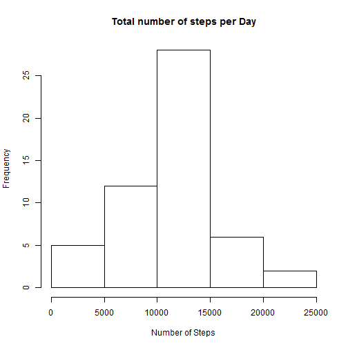
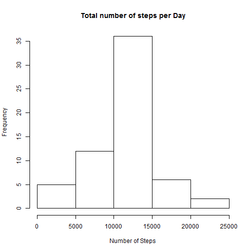
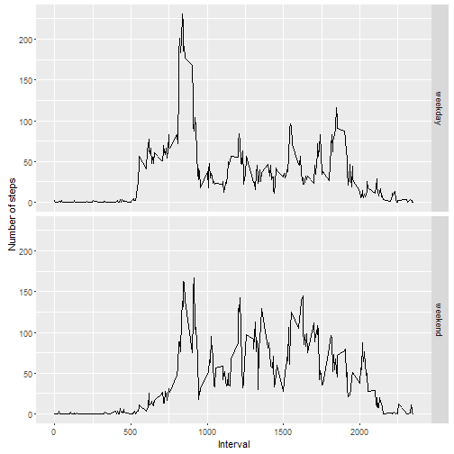

Reproducible Research - Course Project 1
========================================

#####**Loading and preprocessing the data**


```r
library(ggplot2)
library(plyr)
library(lubridate)
library(chron)
```

#####1. Load the data (i.e. read.csv())

a. First, we check if the source file is already unzipped, otherwise unzipped it.


```r
if(!file.exists("activity.csv")) {
  unzip("activity.zip")
}
```

#####2. Process/transform the data (if necessary) into a format sitable for your analysis


```r
data <- read.csv("activity.csv")
data <- data[!is.na(data$steps),]
```

#####**What is mean total number of steps taken per day?**

1. Calculate the total number of seps taken per day.


```r
AggStepsPerDay <- aggregate(data$steps, by=list(data$date), sum)
```

2. Make a histogram o the total number of steps taken each day.


```r
hist(AggStepsPerDay[,2], main = "Total number of steps per Day", xlab = "Number of Steps")
```



3. Calculate and report the mean and median of the total number of steps taken per day


```r
mean(AggStepsPerDay$x)
```

```
## [1] 10766.19
```


```r
median(AggStepsPerDay$x)
```

```
## [1] 10765
```

#####**What is the average daily activity pattern?**

1. Make a time series plot (i.e. type = "l") of the 5-minute interval (x-axis) and the average number of steps taken, averaged across all days (y-axis)

First a new data frame is created holding average steps by interval


```r
AvgStepsbyInterval <- aggregate(list(meanSteps = data$steps), by=list(interval = data$interval), FUN = mean, na.rm = TRUE)
```


```r
ggplot(data=AvgStepsbyInterval, aes(x=interval, y=meanSteps)) + geom_line() + xlab("5-minute interval") + ylab("average number of steps taken") 
```


2. Which 5-minute interval, on average across all the days in the dataset, contains the maximum number of steps?


```r
AvgStepsbyInterval[which.max(AvgStepsbyInterval$meanSteps),]
```

```
##     interval meanSteps
## 104      835  206.1698
```


#####**Imputing missing values**

1. Calculate and report the total number of missing values in the dataset.

Loading data again...

```r
data <- read.csv("activity.csv")
```
Number of NA values...

```r
nrow(data[is.na(data$steps),])
```

```
## [1] 2304
```

2. Devise a strategy for filling in all of the missing values in the dataset.

Dataframe with the avarege steps by interval is created from only the complete cases...

```r
dataCC <- read.csv("activity.csv")
dataCC <- dataCC[!is.na(dataCC),]
AggStepsByIntervalCC <- aggregate(list(AvgSteps = dataCC$steps), by=list(interval =dataCC$interval), mean)
```
Dataframe with only NA values is created...

```r
dataNAVal <- data[is.na(data$steps),]
```
Dataframes are merged and loaded into dataframe dataReplaceNa...

```r
dataReplaceNa <- merge(dataNAVal,AggStepsByIntervalCC, by.dataNAVal="interval", by.AggStepsByIntervalCC="interval")
```

3. Create a new dataset that is equal to the original dataset but with the missing data filled in.

Main dataset and dataReplaceNa are arranged for a correct Update...

```r
NewData <- arrange(data,date,interval)
NewData[is.na(NewData$steps),][,1] <- arrange(dataReplaceNa,date,interval)[,4]
```

4. Make a histogram of the total number of steps taken each day and Calculate and report the mean and median total number of steps taken per day. Do these values differ from the estimates from the first part of the assignment? What is the impact of imputing missing data on the estimates of the total daily number of steps?


```r
AggStepsPerDay <- aggregate(NewData$steps, by=list(NewData$date), sum)
hist(AggStepsPerDay[,2], main = "Total number of steps per Day", xlab = "Number of Steps")
```




```r
mean(AggStepsPerDay$x)
```

```
## [1] 10766.19
```


```r
median(AggStepsPerDay$x)
```

```
## [1] 10766.19
```

the mean stayed the same but the median was affected, definitely the data will not behave as the original and this could cause incorrect conclusions if the imputting is not done carefully.

#####**Are there differences in activity patterns between weekdays and weekends?**

1. Create a new factor variable in the dataset with two levels - "weekday" and "weekend" indicating whether a given date is a weekday or weekend day.


```r
NewData$WeekEnd <- is.weekend(ymd(NewData$date))
NewData[which(NewData$WeekEnd==TRUE),4] <- "weekend"
NewData[which(NewData$WeekEnd==FALSE),4] <- "weekday"
```

2. Make a panel plot containing a time series plot (i.e. type = "l") of the 5-minute interval (x-axis) and the average number of steps taken, averaged across all weekday days or weekend days (y-axis). See the README file in the GitHub repository to see an example of what this plot should look like using simulated data.


```r
AggActNewData <- aggregate(steps ~ interval + WeekEnd, data=NewData, mean)
ggplot(AggActNewData, aes(interval, steps)) + 
    geom_line() + 
    facet_grid(WeekEnd ~ .) +
    xlab("Interval") + 
    ylab("Number of steps")
```


